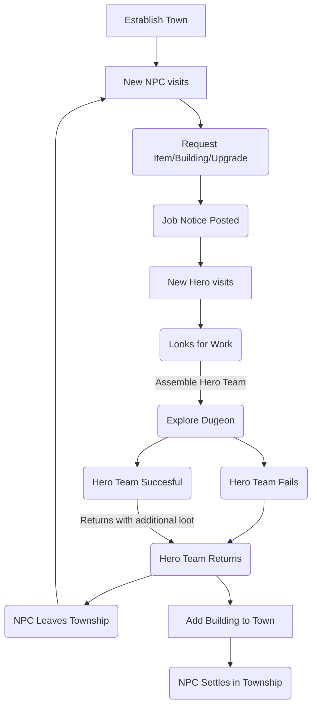

## Key Features

- Town building with various required & optional buildings
  - Upgradable buildings
- Resoruce gathering
  - Resouce mangement
- Quest System via NPC posting on town message board
- Quest System via NPC visiting tavern
- Hero collection via heroes visting tavern

### Town Management

Information Coming Soon

### Hero Collection

- Heroes all start at the same base tier
- Hero rarity tied to town level
  > The higher level your town the more rare heroes will appear in the tavern.

### Dungeon Exploration

Information Coming Soon

## Gameplay Loop

## Around The Internet

- Follow the development of [Project Knightingale Township](https://open.codecks.io/knightingale-township)
- Find my games on Itch.io under [Margaret Cattter Development](https://margaretcatter.itch.io/)
- Keep update on my projects on Cohost under [As Always Imani](https://cohost.org/asalwaysimani)
- Support my projects by buying me milk & cookies on Ko-fi under [As Always Imani](https://ko-fi.com/asalwaysimani)
- Follow my general creative account [As Always Imani on Twitter](https://twitter.com/asalwaysimani)
